# Database Architecture & ERD
## Premium Bikes Managed Marketplace

**Version:** 1.0  
**Date:** 2024  
**Status:** Phase 1 - Discovery & Architecture

---

## Table of Contents

1. [Overview](#1-overview)
2. [Domain Modeling Approach](#2-domain-modeling-approach)
3. [Aggregates & Entities](#3-aggregates--entities)
4. [Entity Relationship Diagram (ERD)](#4-entity-relationship-diagram-erd)
5. [Table Definitions](#5-table-definitions)
6. [Relationships & Constraints](#6-relationships--constraints)
7. [Laravel-Specific Features](#7-laravel-specific-features)
8. [Indexing Strategy](#8-indexing-strategy)
9. [Migration Strategy](#9-migration-strategy)

---

## 1. Overview

This document defines the database architecture for the Premium Bikes Managed Marketplace, following Domain-Driven Design (DDD) principles and Clean Architecture patterns. The database schema is designed to support:

- Product listings with rich metadata
- Inspection and certification workflows
- Trade-in management
- Order processing and payments
- Logistics and shipping
- Workshop management
- User management with role-based access
- Notifications

### 1.1 Design Principles

- **Aggregate Root Pattern**: Each aggregate has a root entity
- **Value Objects**: Immutable objects stored as columns or JSON
- **Normalization**: 3NF where appropriate, denormalization for performance
- **Soft Deletes**: Important entities support soft deletion
- **Audit Trails**: Timestamps and user tracking
- **Polymorphic Relations**: For flexible associations

---

## 2. Domain Modeling Approach

### 2.1 Aggregates Identification

#### Product Catalog Aggregate
- **Root**: `products`
- **Entities**: `product_categories`, `product_images`, `product_specifications`, `product_attributes`
- **Value Objects**: Price (stored as decimal), Dimensions (JSON), Specifications (JSON)

#### Inspection Aggregate
- **Root**: `inspections`
- **Entities**: `inspection_checklists`, `inspection_results`, `certifications`
- **Value Objects**: InspectionStatus (enum), Appointment (datetime + location)

#### Trade-in Aggregate
- **Root**: `trade_ins`
- **Entities**: `trade_in_requests`, `valuations`, `credits`
- **Value Objects**: ValuationAmount (decimal), Condition (enum)

#### Order Aggregate
- **Root**: `orders`
- **Entities**: `order_items`, `payments`, `shipping_addresses`
- **Value Objects**: OrderTotal (decimal), ShippingAddress (JSON or separate table)

#### Logistics Aggregate
- **Root**: `shippings`
- **Entities**: `shipping_labels`, `tracking_infos`
- **Value Objects**: TrackingNumber (string), ShippingRate (decimal)

#### Workshop Aggregate
- **Root**: `workshops`
- **Entities**: `appointments`, `service_records`
- **Value Objects**: AppointmentSlot (datetime)

#### Notification Aggregate
- **Root**: `notifications`
- **Entities**: `notification_preferences`
- **Value Objects**: NotificationChannel (enum), Priority (enum)

#### User Aggregate
- **Root**: `users`
- **Entities**: `user_profiles`, `roles`, `permissions`
- **Value Objects**: Email (string with validation), PhoneNumber (string)

---

## 3. Aggregates & Entities

### 3.1 Product Catalog Aggregate

#### products (Aggregate Root)
- Primary entity for product listings
- Contains core product information
- References certification status

#### product_categories
- Hierarchical category structure
- Supports parent-child relationships

#### product_images
- Multiple images per product
- Supports ordering/priority

#### product_specifications
- Flexible specification storage
- JSON or key-value pairs

#### product_attributes
- Additional attributes (color, size, etc.)
- Extensible structure

### 3.2 Inspection Aggregate

#### inspections (Aggregate Root)
- Tracks inspection lifecycle
- State transitions via status field

#### inspection_checklists
- Standardized checklist items
- Per-inspection results

#### inspection_results
- Detailed inspection findings
- Links to checklist items

#### certifications
- Issued certifications
- References inspection
- Expiration tracking

### 3.3 Trade-in Aggregate

#### trade_ins (Aggregate Root)
- Trade-in request lifecycle
- Links to buyer and product

#### trade_in_requests
- Initial trade-in submission
- Condition and details

#### valuations
- Calculated valuations
- Multiple valuation strategies possible

#### credits
- Applied credits from trade-ins
- Balance tracking

### 3.4 Order Aggregate

#### orders (Aggregate Root)
- Order lifecycle management
- State transitions

#### order_items
- Individual line items
- References products

#### payments
- Payment transactions
- Multiple payment methods
- Refund tracking

#### shipping_addresses
- Delivery addresses
- Can be value object or entity

### 3.5 Logistics Aggregate

#### shippings (Aggregate Root)
- Shipping lifecycle
- Links to orders

#### shipping_labels
- Generated labels
- Carrier information

#### tracking_infos
- Tracking updates
- Status history

---

## 4. Entity Relationship Diagram (ERD)

### 4.1 Core Relationships

```
users
  ├── user_profiles (1:1)
  ├── products (1:N) [seller_id]
  ├── orders (1:N) [buyer_id]
  ├── trade_ins (1:N) [buyer_id]
  ├── inspections (1:N) [seller_id, workshop_id]
  └── workshops (1:1) [if user is workshop]

products
  ├── product_categories (N:1) [category_id]
  ├── product_images (1:N)
  ├── product_specifications (1:N)
  ├── product_attributes (1:N)
  ├── certifications (1:1)
  ├── inspections (1:N)
  └── order_items (1:N)

orders
  ├── order_items (1:N)
  ├── payments (1:N)
  ├── shipping_addresses (1:1)
  └── shippings (1:1)

inspections
  ├── inspection_checklists (1:N)
  ├── inspection_results (1:N)
  └── certifications (1:1)

trade_ins
  ├── trade_in_requests (1:1)
  ├── valuations (1:N)
  └── credits (1:1)

workshops
  ├── appointments (1:N)
  └── service_records (1:N)
```

### 4.2 PlantUML ERD

```plantuml
@startuml ERD_Premium_Bikes_Marketplace

!define TABLE(name,desc) class name as "desc" << (T,#FFAAAA) >>
!define AGGREGATE(name,desc) class name as "desc" << (A,#AAFFAA) >>

' User Management
AGGREGATE(users, "Users\nAggregate Root") {
  + id: bigint [PK]
  + email: string [UK]
  + password: string
  + role: enum
  + email_verified_at: timestamp
  + created_at: timestamp
  + updated_at: timestamp
  + deleted_at: timestamp
}

TABLE(user_profiles, "User Profiles") {
  + id: bigint [PK]
  + user_id: bigint [FK]
  + first_name: string
  + last_name: string
  + phone: string
  + address: json
  + created_at: timestamp
  + updated_at: timestamp
}

TABLE(roles, "Roles") {
  + id: bigint [PK]
  + name: string [UK]
  + display_name: string
  + created_at: timestamp
  + updated_at: timestamp
}

TABLE(permissions, "Permissions") {
  + id: bigint [PK]
  + name: string [UK]
  + display_name: string
  + created_at: timestamp
  + updated_at: timestamp
}

TABLE(role_permission, "Role Permissions") {
  + role_id: bigint [FK,PK]
  + permission_id: bigint [FK,PK]
}

TABLE(user_role, "User Roles") {
  + user_id: bigint [FK,PK]
  + role_id: bigint [FK,PK]
}

' Product Catalog
AGGREGATE(products, "Products\nAggregate Root") {
  + id: bigint [PK]
  + seller_id: bigint [FK]
  + category_id: bigint [FK]
  + title: string
  + description: text
  + brand: string
  + model: string
  + year: integer
  + condition: enum
  + price: decimal(10,2)
  + status: enum
  + certification_id: bigint [FK, nullable]
  + created_at: timestamp
  + updated_at: timestamp
  + deleted_at: timestamp
}

TABLE(product_categories, "Product Categories") {
  + id: bigint [PK]
  + parent_id: bigint [FK, nullable]
  + name: string
  + slug: string [UK]
  + description: text
  + created_at: timestamp
  + updated_at: timestamp
}

TABLE(product_images, "Product Images") {
  + id: bigint [PK]
  + product_id: bigint [FK]
  + path: string
  + order: integer
  + is_primary: boolean
  + created_at: timestamp
  + updated_at: timestamp
}

TABLE(product_specifications, "Product Specifications") {
  + id: bigint [PK]
  + product_id: bigint [FK]
  + key: string
  + value: string
  + created_at: timestamp
  + updated_at: timestamp
}

TABLE(product_attributes, "Product Attributes") {
  + id: bigint [PK]
  + product_id: bigint [FK]
  + attribute_type: string
  + attribute_value: string
  + created_at: timestamp
  + updated_at: timestamp
}

' Inspection & Certification
AGGREGATE(inspections, "Inspections\nAggregate Root") {
  + id: bigint [PK]
  + product_id: bigint [FK]
  + seller_id: bigint [FK]
  + workshop_id: bigint [FK]
  + status: enum
  + requested_at: timestamp
  + scheduled_at: timestamp
  + completed_at: timestamp
  + appointment_location: string
  + notes: text
  + created_at: timestamp
  + updated_at: timestamp
}

TABLE(inspection_checklists, "Inspection Checklists") {
  + id: bigint [PK]
  + inspection_id: bigint [FK]
  + checklist_item: string
  + status: enum
  + notes: text
  + created_at: timestamp
  + updated_at: timestamp
}

TABLE(inspection_results, "Inspection Results") {
  + id: bigint [PK]
  + inspection_id: bigint [FK]
  + checklist_id: bigint [FK]
  + result: enum
  + details: text
  + images: json
  + created_at: timestamp
  + updated_at: timestamp
}

AGGREGATE(certifications, "Certifications\nAggregate Root") {
  + id: bigint [PK]
  + product_id: bigint [FK]
  + inspection_id: bigint [FK]
  + workshop_id: bigint [FK]
  + grade: enum
  + issued_at: timestamp
  + expires_at: timestamp
  + report_url: string
  + status: enum
  + created_at: timestamp
  + updated_at: timestamp
}

' Trade-in
AGGREGATE(trade_ins, "Trade-ins\nAggregate Root") {
  + id: bigint [PK]
  + buyer_id: bigint [FK]
  + status: enum
  + requested_at: timestamp
  + approved_at: timestamp
  + rejected_at: timestamp
  + created_at: timestamp
  + updated_at: timestamp
}

TABLE(trade_in_requests, "Trade-in Requests") {
  + id: bigint [PK]
  + trade_in_id: bigint [FK]
  + brand: string
  + model: string
  + year: integer
  + condition: enum
  + description: text
  + images: json
  + created_at: timestamp
  + updated_at: timestamp
}

TABLE(valuations, "Valuations") {
  + id: bigint [PK]
  + trade_in_id: bigint [FK]
  + amount: decimal(10,2)
  + currency: string
  + strategy_used: string
  + calculated_at: timestamp
  + created_at: timestamp
  + updated_at: timestamp
}

TABLE(credits, "Credits") {
  + id: bigint [PK]
  + user_id: bigint [FK]
  + trade_in_id: bigint [FK]
  + amount: decimal(10,2)
  + balance: decimal(10,2)
  + status: enum
  + expires_at: timestamp
  + created_at: timestamp
  + updated_at: timestamp
}

' Orders & Payments
AGGREGATE(orders, "Orders\nAggregate Root") {
  + id: bigint [PK]
  + order_number: string [UK]
  + buyer_id: bigint [FK]
  + status: enum
  + subtotal: decimal(10,2)
  + tax: decimal(10,2)
  + shipping_cost: decimal(10,2)
  + total: decimal(10,2)
  + currency: string
  + placed_at: timestamp
  + created_at: timestamp
  + updated_at: timestamp
}

TABLE(order_items, "Order Items") {
  + id: bigint [PK]
  + order_id: bigint [FK]
  + product_id: bigint [FK]
  + quantity: integer
  + unit_price: decimal(10,2)
  + total_price: decimal(10,2)
  + created_at: timestamp
  + updated_at: timestamp
}

TABLE(shipping_addresses, "Shipping Addresses") {
  + id: bigint [PK]
  + order_id: bigint [FK]
  + user_id: bigint [FK, nullable]
  + first_name: string
  + last_name: string
  + address_line_1: string
  + address_line_2: string
  + city: string
  + state: string
  + postal_code: string
  + country: string
  + phone: string
  + created_at: timestamp
  + updated_at: timestamp
}

AGGREGATE(payments, "Payments\nAggregate Root") {
  + id: bigint [PK]
  + order_id: bigint [FK]
  + user_id: bigint [FK]
  + payment_method: enum
  + amount: decimal(10,2)
  + currency: string
  + status: enum
  + transaction_id: string
  + gateway_response: json
  + processed_at: timestamp
  + created_at: timestamp
  + updated_at: timestamp
}

' Logistics
AGGREGATE(shippings, "Shippings\nAggregate Root") {
  + id: bigint [PK]
  + order_id: bigint [FK]
  + carrier: string
  + service_type: enum
  + status: enum
  + tracking_number: string [UK, nullable]
  + shipped_at: timestamp
  + delivered_at: timestamp
  + created_at: timestamp
  + updated_at: timestamp
}

TABLE(shipping_labels, "Shipping Labels") {
  + id: bigint [PK]
  + shipping_id: bigint [FK]
  + label_url: string
  + label_data: json
  + created_at: timestamp
  + updated_at: timestamp
}

TABLE(tracking_infos, "Tracking Infos") {
  + id: bigint [PK]
  + shipping_id: bigint [FK]
  + status: string
  + location: string
  + timestamp: timestamp
  + details: text
  + created_at: timestamp
  + updated_at: timestamp
}

' Workshop
AGGREGATE(workshops, "Workshops\nAggregate Root") {
  + id: bigint [PK]
  + user_id: bigint [FK]
  + name: string
  + address: json
  + phone: string
  + email: string
  + certification_level: enum
  + is_active: boolean
  + created_at: timestamp
  + updated_at: timestamp
}

TABLE(appointments, "Appointments") {
  + id: bigint [PK]
  + workshop_id: bigint [FK]
  + inspection_id: bigint [FK, nullable]
  + user_id: bigint [FK, nullable]
  + type: enum
  + scheduled_at: timestamp
  + duration_minutes: integer
  + status: enum
  + notes: text
  + created_at: timestamp
  + updated_at: timestamp
}

TABLE(service_records, "Service Records") {
  + id: bigint [PK]
  + workshop_id: bigint [FK]
  + product_id: bigint [FK, nullable]
  + user_id: bigint [FK]
  + service_type: enum
  + description: text
  + cost: decimal(10,2)
  + performed_at: timestamp
  + created_at: timestamp
  + updated_at: timestamp
}

' Notifications
AGGREGATE(notifications, "Notifications\nAggregate Root") {
  + id: bigint [PK]
  + user_id: bigint [FK]
  + type: string
  + channel: enum
  + title: string
  + message: text
  + data: json
  + read_at: timestamp
  + sent_at: timestamp
  + created_at: timestamp
  + updated_at: timestamp
}

TABLE(notification_preferences, "Notification Preferences") {
  + id: bigint [PK]
  + user_id: bigint [FK]
  + channel: enum
  + type: string
  + enabled: boolean
  + created_at: timestamp
  + updated_at: timestamp
}

' Relationships
users ||--o{ products : "sells"
users ||--o{ orders : "buys"
users ||--|| user_profiles : "has"
users }o--o{ roles : "has"
roles }o--o{ permissions : "has"

products }o--|| product_categories : "belongs_to"
products ||--o{ product_images : "has"
products ||--o{ product_specifications : "has"
products ||--o{ product_attributes : "has"
products ||--o| certifications : "has"
products ||--o{ inspections : "requires"
products ||--o{ order_items : "included_in"

orders ||--o{ order_items : "contains"
orders ||--|| shipping_addresses : "ships_to"
orders ||--o{ payments : "paid_by"
orders ||--|| shippings : "shipped_via"

inspections }o--|| products : "inspects"
inspections }o--|| users : "requested_by"
inspections }o--|| workshops : "performed_by"
inspections ||--o{ inspection_checklists : "has"
inspections ||--o{ inspection_results : "produces"
inspections ||--o| certifications : "results_in"

certifications }o--|| products : "certifies"
certifications }o--|| inspections : "based_on"
certifications }o--|| workshops : "issued_by"

trade_ins }o--|| users : "requested_by"
trade_ins ||--|| trade_in_requests : "contains"
trade_ins ||--o{ valuations : "has"
trade_ins ||--o| credits : "generates"

credits }o--|| users : "belongs_to"

workshops }o--|| users : "owned_by"
workshops ||--o{ appointments : "has"
workshops ||--o{ service_records : "has"

shippings ||--o{ shipping_labels : "has"
shippings ||--o{ tracking_infos : "has"

notifications }o--|| users : "sent_to"
notifications ||--o{ notification_preferences : "configured_by"

@enduml
```



---

## 5. Table Definitions

### 5.1 User Management Tables

#### users
```sql
CREATE TABLE users (
    id BIGINT UNSIGNED PRIMARY KEY AUTO_INCREMENT,
    email VARCHAR(255) UNIQUE NOT NULL,
    password VARCHAR(255) NOT NULL,
    role ENUM('buyer', 'seller', 'workshop', 'admin') NOT NULL DEFAULT 'buyer',
    email_verified_at TIMESTAMP NULL,
    remember_token VARCHAR(100) NULL,
    created_at TIMESTAMP NULL,
    updated_at TIMESTAMP NULL,
    deleted_at TIMESTAMP NULL,
    
    INDEX idx_email (email),
    INDEX idx_role (role),
    INDEX idx_deleted_at (deleted_at)
) ENGINE=InnoDB DEFAULT CHARSET=utf8mb4 COLLATE=utf8mb4_unicode_ci;
```

#### user_profiles
```sql
CREATE TABLE user_profiles (
    id BIGINT UNSIGNED PRIMARY KEY AUTO_INCREMENT,
    user_id BIGINT UNSIGNED NOT NULL,
    first_name VARCHAR(255) NULL,
    last_name VARCHAR(255) NULL,
    phone VARCHAR(20) NULL,
    address JSON NULL,
    created_at TIMESTAMP NULL,
    updated_at TIMESTAMP NULL,
    
    FOREIGN KEY (user_id) REFERENCES users(id) ON DELETE CASCADE,
    UNIQUE KEY uk_user_id (user_id)
) ENGINE=InnoDB DEFAULT CHARSET=utf8mb4 COLLATE=utf8mb4_unicode_ci;
```

### 5.2 Product Catalog Tables

#### products
```sql
CREATE TABLE products (
    id BIGINT UNSIGNED PRIMARY KEY AUTO_INCREMENT,
    seller_id BIGINT UNSIGNED NOT NULL,
    category_id BIGINT UNSIGNED NOT NULL,
    title VARCHAR(255) NOT NULL,
    description TEXT NULL,
    brand VARCHAR(100) NOT NULL,
    model VARCHAR(100) NOT NULL,
    year INT UNSIGNED NULL,
    condition ENUM('new', 'like_new', 'excellent', 'good', 'fair', 'poor') NOT NULL,
    price DECIMAL(10, 2) NOT NULL,
    status ENUM('draft', 'pending_inspection', 'active', 'sold', 'inactive') NOT NULL DEFAULT 'draft',
    certification_id BIGINT UNSIGNED NULL,
    created_at TIMESTAMP NULL,
    updated_at TIMESTAMP NULL,
    deleted_at TIMESTAMP NULL,
    
    FOREIGN KEY (seller_id) REFERENCES users(id) ON DELETE RESTRICT,
    FOREIGN KEY (category_id) REFERENCES product_categories(id) ON DELETE RESTRICT,
    FOREIGN KEY (certification_id) REFERENCES certifications(id) ON DELETE SET NULL,
    INDEX idx_seller_id (seller_id),
    INDEX idx_category_id (category_id),
    INDEX idx_status (status),
    INDEX idx_brand_model (brand, model),
    INDEX idx_price (price),
    FULLTEXT idx_search (title, description, brand, model)
) ENGINE=InnoDB DEFAULT CHARSET=utf8mb4 COLLATE=utf8mb4_unicode_ci;
```

#### product_categories
```sql
CREATE TABLE product_categories (
    id BIGINT UNSIGNED PRIMARY KEY AUTO_INCREMENT,
    parent_id BIGINT UNSIGNED NULL,
    name VARCHAR(255) NOT NULL,
    slug VARCHAR(255) UNIQUE NOT NULL,
    description TEXT NULL,
    created_at TIMESTAMP NULL,
    updated_at TIMESTAMP NULL,
    
    FOREIGN KEY (parent_id) REFERENCES product_categories(id) ON DELETE SET NULL,
    INDEX idx_parent_id (parent_id),
    INDEX idx_slug (slug)
) ENGINE=InnoDB DEFAULT CHARSET=utf8mb4 COLLATE=utf8mb4_unicode_ci;
```

### 5.3 Inspection & Certification Tables

#### inspections
```sql
CREATE TABLE inspections (
    id BIGINT UNSIGNED PRIMARY KEY AUTO_INCREMENT,
    product_id BIGINT UNSIGNED NOT NULL,
    seller_id BIGINT UNSIGNED NOT NULL,
    workshop_id BIGINT UNSIGNED NOT NULL,
    status ENUM('pending', 'scheduled', 'in_progress', 'completed', 'failed', 'cancelled') NOT NULL DEFAULT 'pending',
    requested_at TIMESTAMP NULL,
    scheduled_at TIMESTAMP NULL,
    completed_at TIMESTAMP NULL,
    appointment_location VARCHAR(255) NULL,
    notes TEXT NULL,
    created_at TIMESTAMP NULL,
    updated_at TIMESTAMP NULL,
    
    FOREIGN KEY (product_id) REFERENCES products(id) ON DELETE CASCADE,
    FOREIGN KEY (seller_id) REFERENCES users(id) ON DELETE RESTRICT,
    FOREIGN KEY (workshop_id) REFERENCES workshops(id) ON DELETE RESTRICT,
    INDEX idx_product_id (product_id),
    INDEX idx_workshop_id (workshop_id),
    INDEX idx_status (status),
    INDEX idx_scheduled_at (scheduled_at)
) ENGINE=InnoDB DEFAULT CHARSET=utf8mb4 COLLATE=utf8mb4_unicode_ci;
```

#### certifications
```sql
CREATE TABLE certifications (
    id BIGINT UNSIGNED PRIMARY KEY AUTO_INCREMENT,
    product_id BIGINT UNSIGNED NOT NULL,
    inspection_id BIGINT UNSIGNED NOT NULL,
    workshop_id BIGINT UNSIGNED NOT NULL,
    grade ENUM('excellent', 'very_good', 'good', 'fair') NOT NULL,
    issued_at TIMESTAMP NOT NULL,
    expires_at TIMESTAMP NULL,
    report_url VARCHAR(500) NULL,
    status ENUM('active', 'expired', 'revoked') NOT NULL DEFAULT 'active',
    created_at TIMESTAMP NULL,
    updated_at TIMESTAMP NULL,
    
    FOREIGN KEY (product_id) REFERENCES products(id) ON DELETE CASCADE,
    FOREIGN KEY (inspection_id) REFERENCES inspections(id) ON DELETE RESTRICT,
    FOREIGN KEY (workshop_id) REFERENCES workshops(id) ON DELETE RESTRICT,
    UNIQUE KEY uk_product_id (product_id),
    INDEX idx_status (status),
    INDEX idx_expires_at (expires_at)
) ENGINE=InnoDB DEFAULT CHARSET=utf8mb4 COLLATE=utf8mb4_unicode_ci;
```

### 5.4 Order & Payment Tables

#### orders
```sql
CREATE TABLE orders (
    id BIGINT UNSIGNED PRIMARY KEY AUTO_INCREMENT,
    order_number VARCHAR(50) UNIQUE NOT NULL,
    buyer_id BIGINT UNSIGNED NOT NULL,
    status ENUM('draft', 'pending', 'confirmed', 'processing', 'shipped', 'delivered', 'cancelled', 'refunded') NOT NULL DEFAULT 'draft',
    subtotal DECIMAL(10, 2) NOT NULL DEFAULT 0.00,
    tax DECIMAL(10, 2) NOT NULL DEFAULT 0.00,
    shipping_cost DECIMAL(10, 2) NOT NULL DEFAULT 0.00,
    total DECIMAL(10, 2) NOT NULL DEFAULT 0.00,
    currency VARCHAR(3) NOT NULL DEFAULT 'USD',
    placed_at TIMESTAMP NULL,
    created_at TIMESTAMP NULL,
    updated_at TIMESTAMP NULL,
    
    FOREIGN KEY (buyer_id) REFERENCES users(id) ON DELETE RESTRICT,
    INDEX idx_buyer_id (buyer_id),
    INDEX idx_order_number (order_number),
    INDEX idx_status (status),
    INDEX idx_placed_at (placed_at)
) ENGINE=InnoDB DEFAULT CHARSET=utf8mb4 COLLATE=utf8mb4_unicode_ci;
```

#### payments
```sql
CREATE TABLE payments (
    id BIGINT UNSIGNED PRIMARY KEY AUTO_INCREMENT,
    order_id BIGINT UNSIGNED NOT NULL,
    user_id BIGINT UNSIGNED NOT NULL,
    payment_method ENUM('credit_card', 'paypal', 'trade_in_credit', 'bank_transfer') NOT NULL,
    amount DECIMAL(10, 2) NOT NULL,
    currency VARCHAR(3) NOT NULL DEFAULT 'USD',
    status ENUM('pending', 'processing', 'completed', 'failed', 'refunded') NOT NULL DEFAULT 'pending',
    transaction_id VARCHAR(255) NULL,
    gateway_response JSON NULL,
    processed_at TIMESTAMP NULL,
    created_at TIMESTAMP NULL,
    updated_at TIMESTAMP NULL,
    
    FOREIGN KEY (order_id) REFERENCES orders(id) ON DELETE RESTRICT,
    FOREIGN KEY (user_id) REFERENCES users(id) ON DELETE RESTRICT,
    INDEX idx_order_id (order_id),
    INDEX idx_user_id (user_id),
    INDEX idx_status (status),
    INDEX idx_transaction_id (transaction_id)
) ENGINE=InnoDB DEFAULT CHARSET=utf8mb4 COLLATE=utf8mb4_unicode_ci;
```

### 5.5 Trade-in Tables

#### trade_ins
```sql
CREATE TABLE trade_ins (
    id BIGINT UNSIGNED PRIMARY KEY AUTO_INCREMENT,
    buyer_id BIGINT UNSIGNED NOT NULL,
    status ENUM('pending', 'valuated', 'approved', 'rejected', 'completed') NOT NULL DEFAULT 'pending',
    requested_at TIMESTAMP NULL,
    approved_at TIMESTAMP NULL,
    rejected_at TIMESTAMP NULL,
    created_at TIMESTAMP NULL,
    updated_at TIMESTAMP NULL,
    
    FOREIGN KEY (buyer_id) REFERENCES users(id) ON DELETE RESTRICT,
    INDEX idx_buyer_id (buyer_id),
    INDEX idx_status (status)
) ENGINE=InnoDB DEFAULT CHARSET=utf8mb4 COLLATE=utf8mb4_unicode_ci;
```

#### credits
```sql
CREATE TABLE credits (
    id BIGINT UNSIGNED PRIMARY KEY AUTO_INCREMENT,
    user_id BIGINT UNSIGNED NOT NULL,
    trade_in_id BIGINT UNSIGNED NULL,
    amount DECIMAL(10, 2) NOT NULL,
    balance DECIMAL(10, 2) NOT NULL,
    status ENUM('active', 'used', 'expired') NOT NULL DEFAULT 'active',
    expires_at TIMESTAMP NULL,
    created_at TIMESTAMP NULL,
    updated_at TIMESTAMP NULL,
    
    FOREIGN KEY (user_id) REFERENCES users(id) ON DELETE RESTRICT,
    FOREIGN KEY (trade_in_id) REFERENCES trade_ins(id) ON DELETE SET NULL,
    INDEX idx_user_id (user_id),
    INDEX idx_status (status),
    INDEX idx_expires_at (expires_at)
) ENGINE=InnoDB DEFAULT CHARSET=utf8mb4 COLLATE=utf8mb4_unicode_ci;
```

---

## 6. Relationships & Constraints

### 6.1 Foreign Key Constraints

All foreign keys follow these rules:
- **ON DELETE CASCADE**: For dependent entities (e.g., `order_items` → `orders`)
- **ON DELETE RESTRICT**: For critical relationships (e.g., `orders` → `users`)
- **ON DELETE SET NULL**: For optional relationships (e.g., `products.certification_id`)

### 6.2 Unique Constraints

- `users.email`: Unique email addresses
- `products.certification_id`: One certification per product (via unique index)
- `orders.order_number`: Unique order numbers
- `shippings.tracking_number`: Unique tracking numbers

### 6.3 Check Constraints

- `products.price > 0`
- `orders.total >= 0`
- `payments.amount > 0`
- `credits.balance >= 0`

---

## 7. Laravel-Specific Features

### 7.1 Eloquent API Resources

#### ProductResource
```php
// app/Infrastructure/Http/Resources/ProductResource.php
class ProductResource extends JsonResource
{
    public function toArray($request)
    {
        return [
            'id' => $this->id,
            'title' => $this->title,
            'price' => new PriceResource($this->price),
            'certification' => new CertificationResource($this->whenLoaded('certification')),
            'images' => ProductImageResource::collection($this->whenLoaded('images')),
        ];
    }
}
```

### 7.2 Custom Casts for Value Objects

#### Price Cast
```php
// app/Infrastructure/Database/Casts/PriceCast.php
class PriceCast implements CastsAttributes
{
    public function get($model, $key, $value, $attributes)
    {
        return Price::fromDatabase($value, $attributes['currency'] ?? 'USD');
    }

    public function set($model, $key, $value, $attributes)
    {
        if ($value instanceof Price) {
            return [
                $key => $value->getAmount(),
                'currency' => $value->getCurrency(),
            ];
        }
        return [$key => $value];
    }
}
```

#### Usage in Model
```php
// app/Domain/Product/Models/Product.php
protected $casts = [
    'price' => PriceCast::class,
    'address' => AddressCast::class,
];
```

### 7.3 Polymorphic Relations

#### Notifications (Polymorphic)
```php
// notifications table
morphs('notifiable'); // creates notifiable_type and notifiable_id

// In User model
public function notifications()
{
    return $this->morphMany(Notification::class, 'notifiable');
}
```

### 7.4 Soft Deletes

Important aggregates support soft deletes:
- `users`
- `products`
- `orders` (for audit purposes)

### 7.5 Timestamps & Audit Trails

All tables include:
- `created_at`: Record creation timestamp
- `updated_at`: Last update timestamp

Key tables include:
- `deleted_at`: Soft delete timestamp
- `email_verified_at`: Email verification
- `placed_at`, `processed_at`, `shipped_at`: Business event timestamps

---

## 8. Indexing Strategy

### 8.1 Primary Indexes
- All tables have `id` as PRIMARY KEY

### 8.2 Foreign Key Indexes
- All foreign keys are indexed for join performance

### 8.3 Search Indexes
- `products`: Full-text index on `title`, `description`, `brand`, `model`
- `products`: Composite index on `brand`, `model`
- `products`: Index on `price` for range queries
- `products`: Index on `status` for filtering

### 8.4 Query Optimization Indexes
- `orders`: Index on `buyer_id`, `status`, `placed_at`
- `inspections`: Index on `status`, `scheduled_at`
- `payments`: Index on `status`, `transaction_id`
- `notifications`: Index on `user_id`, `read_at`

### 8.5 Composite Indexes
- `(user_id, status)` for user-specific filtered queries
- `(product_id, status)` for product status queries
- `(order_id, status)` for order status tracking

---

## 9. Migration Strategy

### 9.1 Migration Order

1. **Core Tables**
   - `users`
   - `roles`, `permissions`
   - `user_profiles`

2. **Product Catalog**
   - `product_categories`
   - `products`
   - `product_images`
   - `product_specifications`
   - `product_attributes`

3. **Workshop**
   - `workshops`
   - `appointments`
   - `service_records`

4. **Inspection & Certification**
   - `inspections`
   - `inspection_checklists`
   - `inspection_results`
   - `certifications`

5. **Trade-in**
   - `trade_ins`
   - `trade_in_requests`
   - `valuations`
   - `credits`

6. **Orders & Payments**
   - `orders`
   - `order_items`
   - `shipping_addresses`
   - `payments`

7. **Logistics**
   - `shippings`
   - `shipping_labels`
   - `tracking_infos`

8. **Notifications**
   - `notifications`
   - `notification_preferences`

### 9.2 Data Seeding Strategy

- **Roles & Permissions**: Seed default roles (buyer, seller, workshop, admin)
- **Product Categories**: Seed initial category hierarchy
- **Workshops**: Seed sample workshop partners
- **Admin User**: Create initial admin account

### 9.3 Migration Best Practices

- Use transactions for data migrations
- Add indexes in separate migrations if large tables
- Use `->after()` for column ordering
- Document breaking changes
- Provide rollback strategies

---

## Appendix A: Value Objects Storage

### A.1 Price Value Object
- Stored as: `DECIMAL(10, 2)` + `currency VARCHAR(3)`
- Laravel Cast: `PriceCast`

### A.2 Address Value Object
- Stored as: JSON column or separate columns
- Laravel Cast: `AddressCast` or `AsArrayObject`

### A.3 Dimensions Value Object
- Stored as: JSON column
- Structure: `{"length": 180, "width": 60, "height": 100, "unit": "cm"}`

### A.4 Specifications Value Object
- Stored as: JSON column or `product_specifications` table
- Flexible key-value pairs

---

## Appendix B: Enum Values Reference

### Product Status
- `draft`, `pending_inspection`, `active`, `sold`, `inactive`

### Product Condition
- `new`, `like_new`, `excellent`, `good`, `fair`, `poor`

### Inspection Status
- `pending`, `scheduled`, `in_progress`, `completed`, `failed`, `cancelled`

### Order Status
- `draft`, `pending`, `confirmed`, `processing`, `shipped`, `delivered`, `cancelled`, `refunded`

### Payment Status
- `pending`, `processing`, `completed`, `failed`, `refunded`

### Payment Method
- `credit_card`, `paypal`, `trade_in_credit`, `bank_transfer`

---

**Document Status**: Complete  
**Next Steps**: Proceed to Sequence Diagrams documentation

