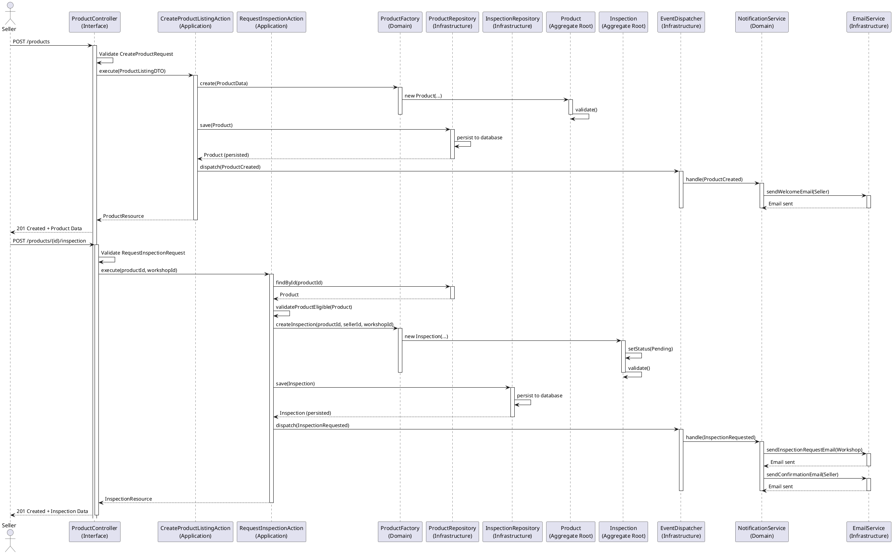
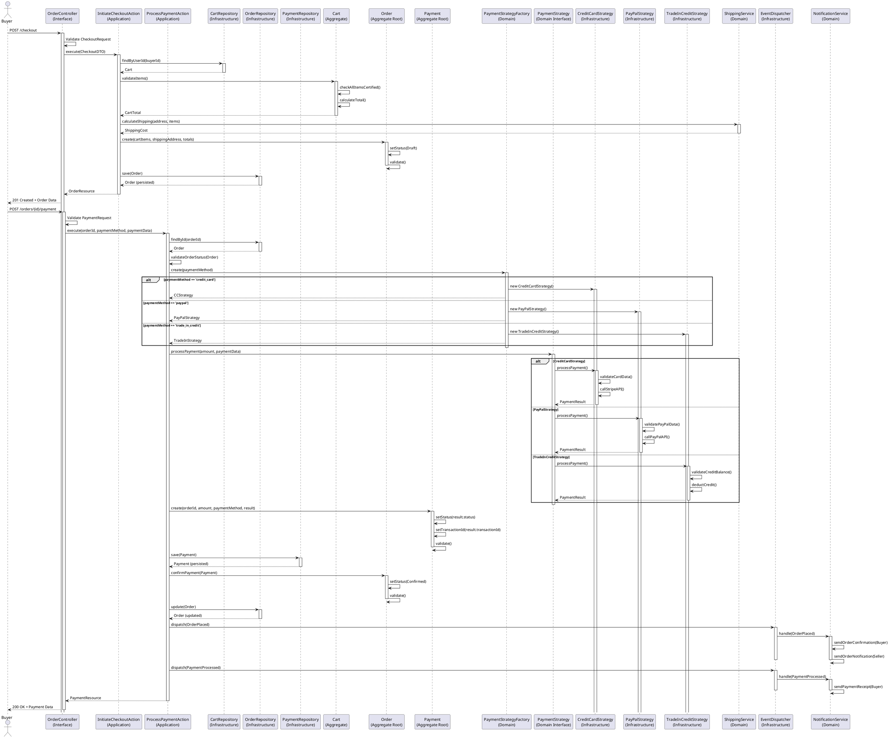
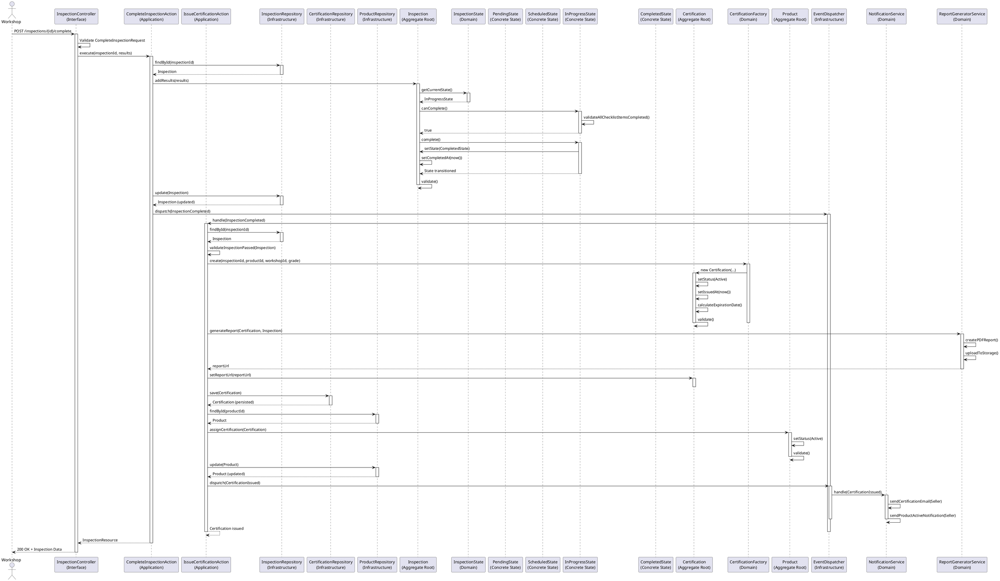
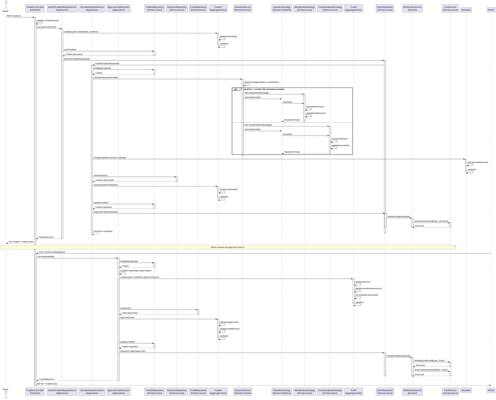

# Sequence Diagrams
## Premium Bikes Managed Marketplace

**Version:** 1.0  
**Date:** 2024  
**Status:** Phase 1 - Discovery & Architecture

---

## Table of Contents

1. [Overview](#1-overview)
2. [Adding Product + Requesting Inspection](#2-adding-product--requesting-inspection)
3. [Checkout Flow with Payment Strategy](#3-checkout-flow-with-payment-strategy)
4. [Issuing Certified Report with State Pattern](#4-issuing-certified-report-with-state-pattern)
5. [Trade-in Flow with Domain Events](#5-trade-in-flow-with-domain-events)

---

## 1. Overview

This document contains sequence diagrams illustrating key workflows in the Premium Bikes Managed Marketplace. Each diagram follows Clean Architecture principles, highlighting:

- **Use Cases** (Application Layer)
- **Repositories** (Infrastructure Layer)
- **Domain Services** (Domain Layer)
- **Event Dispatching** (Observer Pattern)
- **State Transitions** (State Pattern)
- **Strategy Pattern** implementations

All diagrams are written in PlantUML format and can be rendered using PlantUML tools or VS Code extensions.

---

## 2. Adding Product + Requesting Inspection

### 2.1 Use Case Description

**Actor**: Seller  
**Goal**: Create a product listing and immediately request inspection  
**Preconditions**: User authenticated as seller  
**Postconditions**: Product created, inspection requested, notifications sent

### 2.2 Sequence Diagram



### 2.3 Clean Architecture Highlights

- **Interface Layer**: `ProductController` handles HTTP requests
- **Application Layer**: `CreateProductListingAction`, `RequestInspectionAction` orchestrate use cases
- **Domain Layer**: `Product`, `Inspection` aggregates contain business logic
- **Infrastructure Layer**: `ProductRepository`, `InspectionRepository` handle persistence
- **Patterns**: Factory Pattern (ProductFactory), Observer Pattern (EventDispatcher), Repository Pattern

---

## 3. Checkout Flow with Payment Strategy

### 3.1 Use Case Description

**Actor**: Buyer  
**Goal**: Complete checkout with selected payment method  
**Preconditions**: Cart has items, all items certified, user authenticated  
**Postconditions**: Order created, payment processed, notifications sent

### 3.2 Sequence Diagram



### 3.3 Clean Architecture Highlights

- **Strategy Pattern**: `PaymentStrategy` interface with multiple implementations
- **Factory Pattern**: `PaymentStrategyFactory` selects appropriate strategy
- **State Pattern**: `Order` state transitions (Draft → Confirmed)
- **Observer Pattern**: Domain events trigger notifications
- **Repository Pattern**: Data persistence abstraction

---

## 4. Issuing Certified Report with State Pattern

### 4.1 Use Case Description

**Actor**: Workshop (System)  
**Goal**: Complete inspection and issue certification report  
**Preconditions**: Inspection in "InProgress" state, all checklist items completed  
**Postconditions**: Certification issued, product status updated, notifications sent

### 4.2 Sequence Diagram



### 4.3 Clean Architecture Highlights

- **State Pattern**: `InspectionState` interface with concrete states (Pending, Scheduled, InProgress, Completed)
- **State Transitions**: Controlled transitions via state methods
- **Factory Pattern**: `CertificationFactory` creates certification aggregates
- **Domain Service**: `ReportGeneratorService` handles report generation
- **Observer Pattern**: Events trigger certification issuance workflow

### 4.4 State Pattern Implementation Details

```php
// Domain Layer: InspectionState interface
interface InspectionState
{
    public function canSchedule(): bool;
    public function canStart(): bool;
    public function canComplete(): bool;
    public function schedule(Inspection $inspection): void;
    public function start(Inspection $inspection): void;
    public function complete(Inspection $inspection): void;
}

// Concrete States
class PendingState implements InspectionState { ... }
class ScheduledState implements InspectionState { ... }
class InProgressState implements InspectionState { ... }
class CompletedState implements InspectionState { ... }
```

---

## 5. Trade-in Flow with Domain Events

### 5.1 Use Case Description

**Actor**: Buyer  
**Goal**: Submit trade-in request, receive valuation, and get credit approval  
**Preconditions**: User authenticated as buyer  
**Postconditions**: Trade-in request created, valuation calculated, credit approved (if applicable), notifications sent

### 5.2 Sequence Diagram



### 5.3 Clean Architecture Highlights

- **Domain Events**: `TradeInRequested`, `TradeInValuated`, `TradeInApproved` trigger workflows
- **Strategy Pattern**: `ValuationStrategy` with multiple calculation strategies
- **Domain Service**: `ValuationService` orchestrates valuation logic
- **Event-Driven**: Asynchronous processing via event listeners
- **State Pattern**: Trade-in status transitions (Pending → Valuated → Approved)

### 5.4 Domain Events Flow

1. **TradeInRequested**: Triggers automatic valuation calculation
2. **TradeInValuated**: Notifies buyer of valuation result
3. **TradeInApproved**: Creates credit and notifies buyer

---

## Appendix A: PlantUML Rendering

### A.1 VS Code Extension
Install "PlantUML" extension by jebbs to render diagrams

### A.2 Online Renderer
Use http://www.plantuml.com/plantuml/uml/ for online rendering

### A.3 Command Line
```bash
java -jar plantuml.jar sequence-diagrams.md
```

---

## Appendix B: Diagram Conventions

### B.1 Participant Naming
- **Controllers**: `{Module}Controller (Interface)`
- **Actions**: `{Action}Action (Application)`
- **Repositories**: `{Entity}Repository (Infrastructure)`
- **Aggregates**: `{Entity} (Aggregate Root)`
- **Services**: `{Service}Service (Domain)` or `(Infrastructure)`

### B.2 Activation Boxes
- Activate/deactivate to show method execution scope
- Nested activations show call hierarchy

### B.3 Notes
- Use `note over` for important clarifications
- Use `note right/left` for side comments

### B.4 Alt Blocks
- Use `alt/else/end` for conditional flows
- Use `loop/end` for iterations (if needed)

---

**Document Status**: Complete  
**Next Steps**: Proceed to Wireframes documentation

